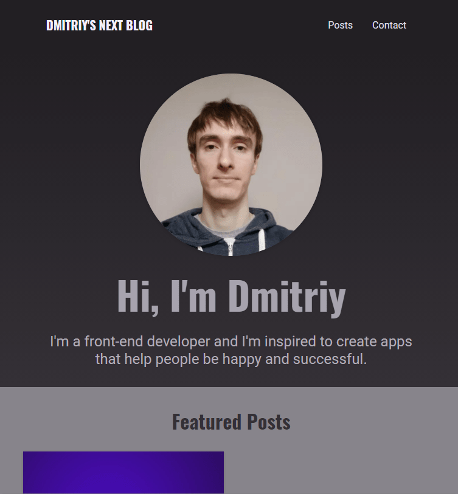

# Next-Blog

This is a training project from nextjs course.

Tech stack:

- [Nextjs](https://nextjs.org/);
- [Mongodb]();
- [gray-matter](https://github.com/jonschlinkert/gray-matter)

## What has been done

Used static page generation to improve performance and SEO. Created api to interact with mongodb to store data. Parsing blog posts from yaml files.

This is a [Next.js](https://nextjs.org/) project bootstrapped with [`create-next-app`](https://github.com/vercel/next.js/tree/canary/packages/create-next-app).
